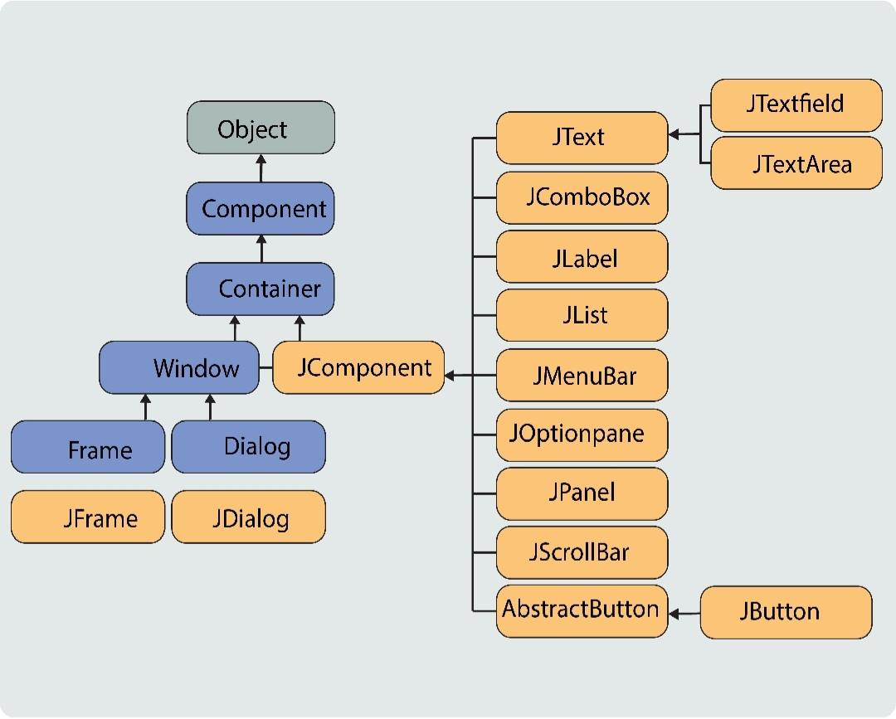
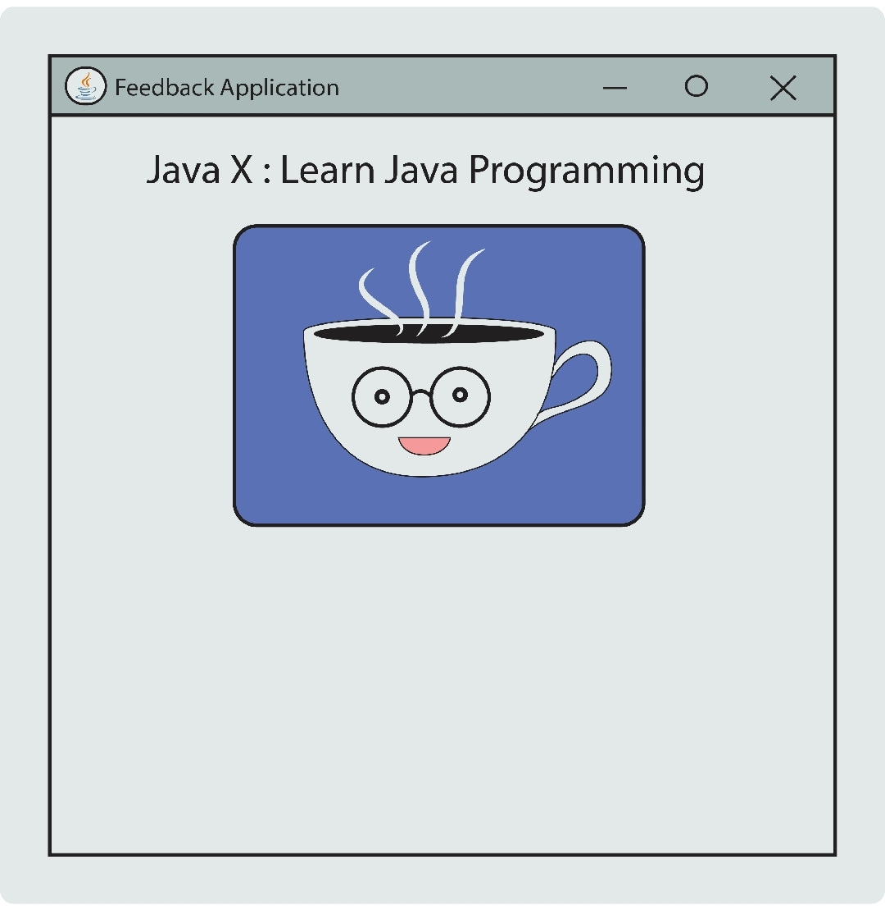
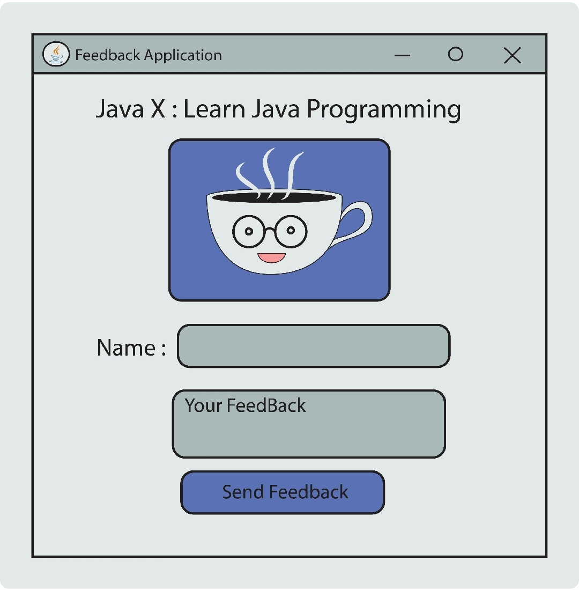
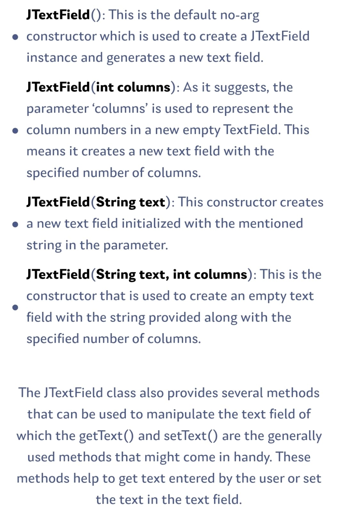
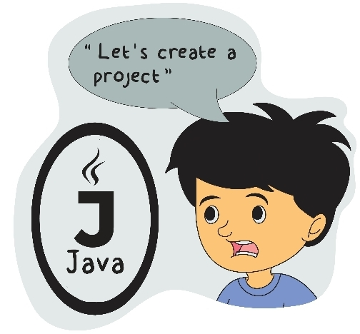

# Swing-GUI-journey-6
a GUI is a UI, which uses graphics to interact with the user, GUI stands for Graphical User Interface. These can be buttons, menus, images, and more. The GUI for many programs differs in layout and exact function.
Swing GUI Quick StartJava Swing is a lightweight GUI (Graphical User Interface) toolkit used to build window-based applications. It is built on top of the older AWT (Abstract Window Toolkit) and is entirely written in Java.

Core Features:
-> Platform Independent: Components are painted by Java, ensuring a consistent look across OS platforms.
->Component-Rich: Offers advanced components like tables, trees, tabbed panes, and text areas.
->Pluggable Look and Feel: Allows dynamic switching of the application's visual style.
->MVC Architecture: Separates data (Model) from the visual display (View).
Basic Hierarchy:
JFrame: The main top-level window container.
JPanel: A generic container to organize components inside a frame.
JButton, JLabel, JTextField: Individual interactive components.

Common Layout Managers:
Layout managers control the positioning and sizing of components within containers.
FlowLayout: Places components in a row, wrapping to the next line if needed (Default for JPanel).
BorderLayout: Divides the container into five regions: North, South, East, West, and Center (Default for JFrame).
GridLayout: Arranges components in a rectangular grid of equal-sized cells.
BoxLayout: Lines up components either vertically or horizontally.

# Commonly Used Swing GUI Components: 1
Swing provides a set of components that we can include in our programs and avail the rich functionalities using which we can develop highly customised
and effecient GUI applications.

But what is a Swing component? What does it refer to?
A component is an independent visual control and Java Swing Framework contains a large set of these components which provide rich functionalities and
allow a high level of customization.

These components represent various GUI functionalities and can be implemented by a different Java class provided by the Swing API. These classes are derived from the JComponent class as illustrated in the below image.

Some examples of the Swing component would be JLabel, JButton, JTextField, JList, and more which we are going to explore right here!
I have created a GUI for your understanding u can explore the .Java code files!!
The result of journey-6 Feedback-app-2 code is shown below:

Let's explore some of the Java Swing components and start with the JLabel component.
The JLabel component in Swing represented by the JLabel class is used to display a non-editable text on the GUI. In simple words , it is used to display some read-only text onto the GUI window.

1) JLabel(): This is the default no-arg constructor which is used to create a JLabel instance with
             no image and with an empty string for the title.
2) JLabel():(String text): This parameterized constructor accepts a String as the parameter and creates a JLabel
                           with the specified text as the label.
3) JLabel(Icon image): This constructor creates a label with only a specified econ or image. The icon or imae file
                       can be used from your own file system.
4) JLabel(String text, int horizontalAlignment): This constructor instance is used to creaate a label with the specified                                                      text along with horizontal alignment.
5) JLabel(Icon image, int horizontalAlignment):  This constructor instance is used to create as specified image or con along                                                  with horizontal alignment.

The JLabel class also provides several methods that can be used to manipulate the label of which the
getText() and  setText() are the generally used methods that might come in handy.

So far we ahve added a text label and an image label to our GUI application. Now, let's complete the next of the GUI as per the code 
Feedback-App-3 output is shown below:

Following are the components we will need,
1) JTextField- To create a text field for the user to enter their name.
2) JTextArea- To create a text area similar to a text field but a little larger in size for the iuser to enter their feedback.
3) JButton- A button using which the user can perform some action such as sending the feedback.
Therefore, let's explore these Swing components (shown in the image below) before we move ahead and complete the code.

Exploring evern more JTextArea by creating and using an instance for this class using any of the below constructors:
1) JTextArea()
2) JTextArea(int rows, int columns)
3) JTextArea(String text)
4) JTextArea(String text, int rows, int columns)
It also provides several methods such as insert(), append(), getRows(), getLines(), getColumns, and more...

Exploring JButtons:
Buttons are an important component of any GUI application. They allow users to interact with the application. 
In order to make our JButtons perform an action when clicked , we need to listen for that evern and handle it accordingly!
We can simply use JButtons bu creating an using an instance for this class using any of the below constructors.
1) JButton()
2) JButton(String text)
3) JButton(Icon icon)

Now to get a clear picture let's do it explore code Feedback-App-3!

Surely, in the upcoming sections, we learn how to make our GUI interactive and handle user actions and events and we will update this mini-application!!

Navigate to README1.md file pls!
