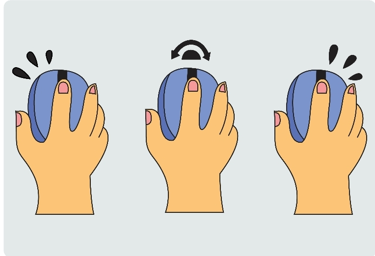
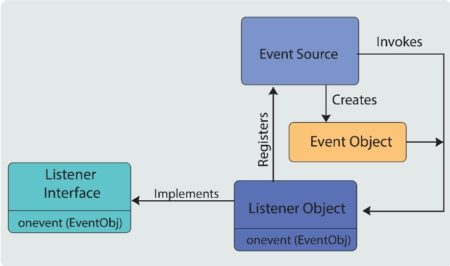
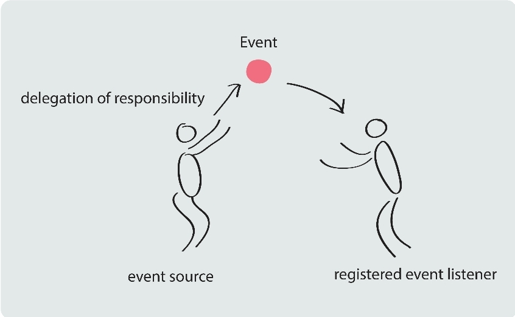
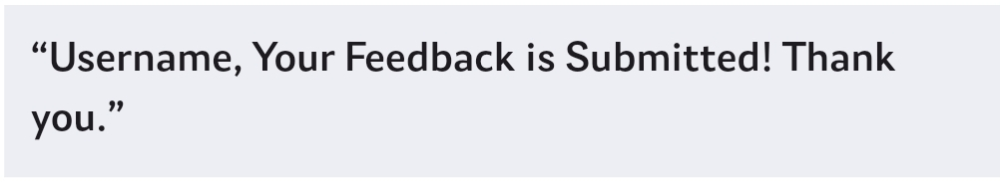
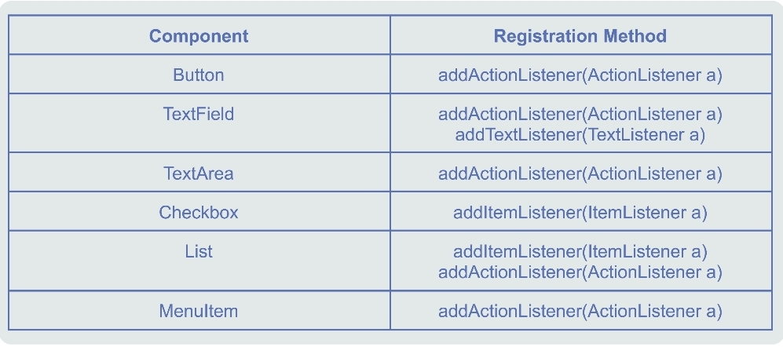

# Event and Event Handling:

Before we get ourselves talking about event handling, let's quickly understand what an event is?

An event is a signal received by a program from the opereating system as a result of some action taken by the user
, or because something else has happened. In simple words, whenever the user interacts with a program and performs an 
action such as keypress, button click, and more, it triggers an event.

Therefore, events are generated as a result of user intereaction with the greaphical user interface components.
Note that in Java, whenever an evert is trigerred, it results in the creation of an event object.

Event Handling is the mechanism that controls the event and decides what should happen if an 
event occurs.
In Java, the *Delegation Even Model* is used to handle the events. This model is defines the std.
 mechanism to generate and handle the events.
 *General Trivia*: Events are supported by a number of Java packages, like java.util, jaca.awt, and java.awt.event

 1) *Delegation Event Model*

The modern approach to handling events is based on the delegation event model.
This model defines std, and consistent mechanism to generate and process events.
In this model, a class designated as an event source generates an event and sends it to one or more listeners.
The resposibility of handling the event process is handed over to its listeners. 
The listener classes wait in the vicinity, to spring into action only when it is poked by the event that it is interested in.

However, the listener must be registered with the event source class to receive any notification.
This means that a particular event is processed only by a specific listener.

*Event*: The event obj defines the change in state in the event source class. For example, interacting
         with graphical interaces, such as clicking a button.
         
*Event Source*: Event listeners are objects that are notified as soon as specific event occurs.
*Event Listeners*: Event listeners must define the methods to process the notificatin they are interested to receive

Classes and Iterfaces:
1) ActionEvent: An action event is a semantic event that indicates that a component-defined action
2) MouseEvent: The MouseEvent class represents events that occur due to the user interacting with a pointing device.
3) KeyEvent: A KeyEvent is generated when keyboard input occurs. This low-level event is generatd by a
             a component object.
4) ItemEvent: It is a semantic event that indicates that an item was selected or deselected.

Let's Code!!

Make sure u have the Feedback-App-3 GUI code handy!!
This one!!

# Aim:
To handle an event and perform some action when the "Send Feedvack" button is clicked.
Therefore, whenever the user clicks on the send buton , the applicatin should return a nice message 
in the following format below!

Let's CODE! (Feedback-App-4.Java)

Useful Table:

